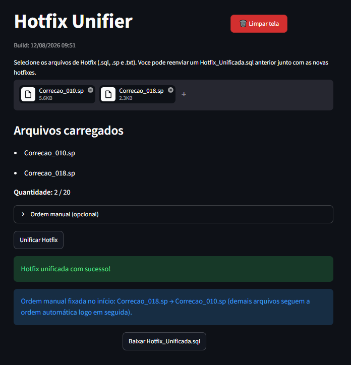
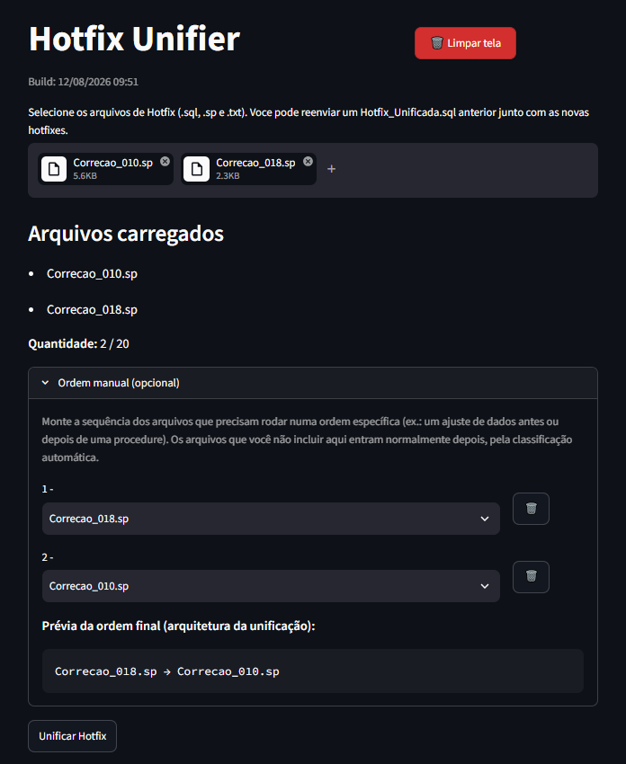

# Hotfix Unifier

**Unifica múltiplas hotfixes de banco Firebird/Interbase em um único script SQL, na ordem correta de dependência.**

[](https://www.python.org/)
[](https://streamlit.io/)
[](tests/)
[](LICENSE)

<p align="center">
  
</p>

---

## O problema

Uma correção de banco raramente cabe em um arquivo só. Um ciclo de manutenção
acumula vários arquivos soltos — `ajuste_estoque.sp`, `001_tabela.sql`, `nota.txt`
— e todos precisam ser executados **na ordem certa**.

A ordem não é uma preferência: é uma restrição do próprio banco, porque os objetos
dependem uns dos outros.

- Uma `PROCEDURE` que lê uma coluna nova falha se o `ALTER TABLE` não rodou antes.
- Uma procedure que chama outra falha se a *assinatura* da chamada ainda não existe.
- Uma `TRIGGER` ou `VIEW` falha se a procedure/tabela que ela usa ainda não está lá.

Determinar essa ordem manualmente é trabalho repetitivo e propenso a erro, e o custo
cresce com o número de arquivos. Some a isso o versionamento: quando uma correção nova
reescreve uma procedure já ajustada em um ciclo anterior, é preciso saber **qual das
duas versões vale**.

## A solução

Uma interface web onde você joga todos os arquivos de uma vez e recebe um único
`Hotfix_Unificada.sql` pronto para executar:

- **Ordena por estágio de dependência** — tabelas → assinaturas de procedures → corpo
  das procedures → triggers → views → ajustes de dados/grants. A classificação lê o
  conteúdo SQL de cada arquivo, não o nome dele.
- **Resolve versões duplicadas** — reenvie o unificado do ciclo anterior junto com as
  correções novas: cada procedure/trigger/view redefinida é substituída pela versão
  mais recente em vez de duplicada, e a tela avisa exatamente o que foi trocado.
- **Aplica `SET TERM` automaticamente** — blocos com `;` interno são envolvidos no
  terminador alternativo, para o script inteiro rodar de uma vez no IBExpert/isql.
- **Nunca reescreve seu SQL** — o conteúdo original é preservado byte a byte. A
  ferramenta só reordena, agrupa e adiciona cabeçalhos de comentário.
- **Ordem manual quando a heurística não basta** — dá para fixar a sequência de
  arquivos específicos (ex.: um `UPDATE` que precisa rodar antes de uma procedure),
  com prévia da ordem final em tempo real.

<p align="center">
  
  <br>
  <em>A prévia mostra a sequência resultante antes de você gerar o arquivo.</em>
</p>

## Ordem de execução aplicada

| # | Categoria | Detectada por |
|---|---|---|
| 1 | Tabelas (estrutura) | `CREATE/ALTER TABLE`, `CREATE/ALTER INDEX`, `CREATE/ALTER DOMAIN` |
| 2 | Assinatura de procedures/functions | `CREATE/ALTER PROCEDURE` com corpo vazio ou só `SUSPEND` |
| 3 | Implementação de procedures/functions | `CREATE/ALTER PROCEDURE` com lógica real |
| 4 | Triggers | `CREATE/ALTER TRIGGER` |
| 5 | Views | `CREATE/ALTER/RECREATE VIEW` |
| 6 | Ajustes finais | `GRANT`, `INSERT`, `UPDATE`, `DELETE` de dados |

## Como rodar

```bash
git clone https://github.com/willian-silva01/Unificador_Hotfix.git
cd Unificador_Hotfix

python -m venv .venv
source .venv/bin/activate      # Windows: .venv\Scripts\activate

pip install -r requirements.txt
streamlit run src/app.py
```

A aplicação sobe em `http://localhost:8501`.

### Experimente com os exemplos

A pasta [`examples/`](examples/) traz seis hotfixes sintéticas, uma por categoria,
propositalmente numeradas fora de ordem de dependência. Envie todas de uma vez e
compare a ordem de upload com a ordem do arquivo gerado.

## Testes

```bash
pip install pytest
python -m pytest tests -q
```

20 testes cobrindo validação de entrada, classificação por categoria, aplicação de
`SET TERM`, resolução de versões ao reimportar um unificado e ordem manual.

## Estrutura

```
├── src/
│   ├── app.py          # Interface Streamlit (upload, prévia da ordem, download)
│   ├── validator.py    # Validação de extensão, conteúdo SQL e limite de arquivos
│   └── merger.py       # Classificação, ordenação, versionamento e montagem do SQL
├── examples/           # Hotfixes de exemplo (sintéticas), uma por categoria
├── tests/              # Suíte pytest
├── docs/
│   ├── DOCUMENTACAO.md # Documentação técnica detalhada
│   └── img/            # Capturas de tela usadas no README
└── scripts/            # Publicação como serviço no Windows (opcional)
```

Documentação técnica completa — fluxo interno, regras de validação, formato de saída,
implantação e limitações conhecidas — em [`docs/DOCUMENTACAO.md`](docs/DOCUMENTACAO.md).

## Limitações conhecidas

- Classificação e versionamento acontecem **por arquivo inteiro**, não por comando. O
  padrão recomendado é um objeto/mudança por arquivo.
- A detecção usa expressões regulares sobre o texto SQL, não um parser PSQL completo.
- Conflito entre duas hotfixes novas do mesmo objeto é resolvido por ordem alfabética
  do nome do arquivo — a tela sempre avisa para conferência manual.
- Sem banco de dados, autenticação ou histórico: cada unificação é isolada.

## Stack

Python 3.12+ · Streamlit · biblioteca padrão (`re`, `pathlib`) · pytest

Sem banco de dados, sem dependências externas além do Streamlit.

## Licença

[MIT](LICENSE)
